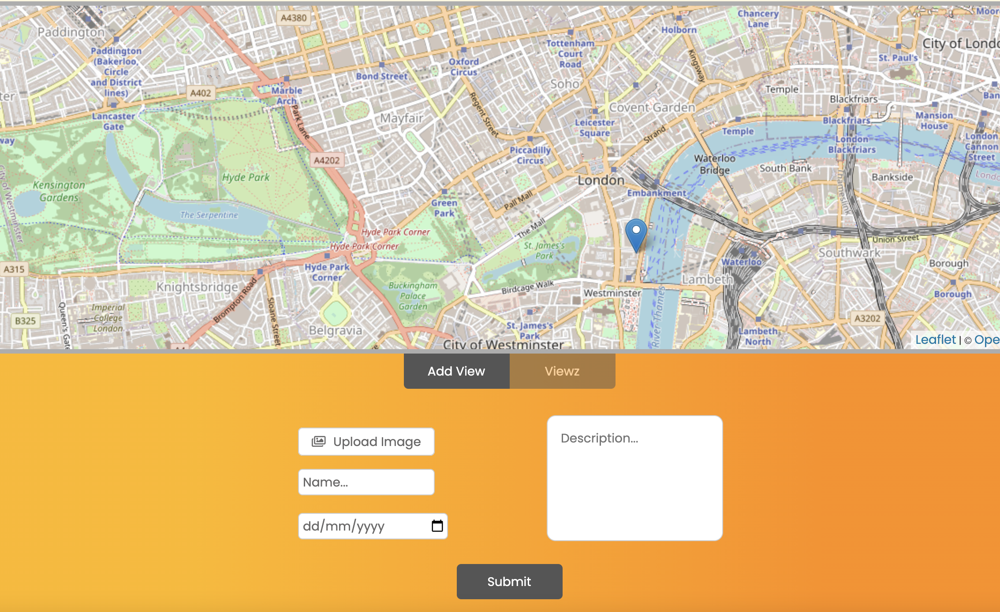
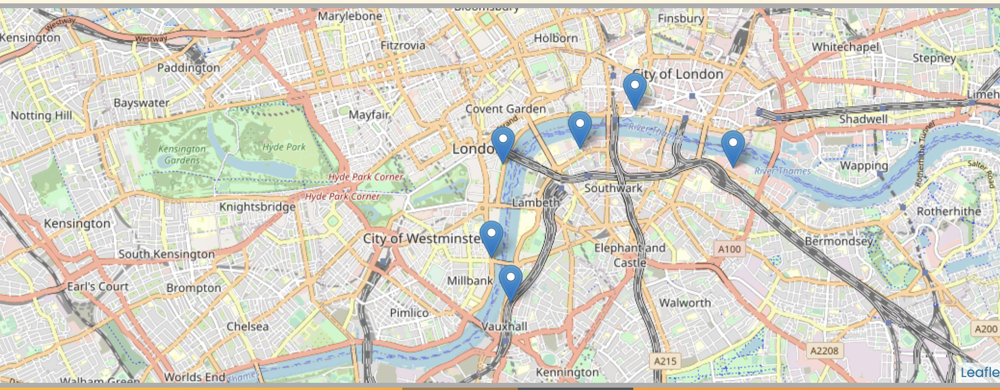

# Viewz

A Web Application that users can use to post amazing photos of different visited locations and display them on a map for other users to view.

# Table of contents

## 1. UX

- User Stories
- Strategy
- Scope
- Structure
- Skeleton
- Surface

## Features

- Existing Features
- Features Left to Implement

## 3. Technologies

## 4. Testing

## 5. Delpoyment

## 6. Credits

- Acknoledgements

# User Experiance

## 1. User stories

- As a user, I want to add my photos with location, description, name and date, so that other users can view my images.
  

- As a user, I want to see an overview of all my locations that I have visited.
  

- As a user I want to be able to search through all my previous views
  

- As a user, I want to see all my images and locations when I leave the app so that I can keep using the app over time.

### As a site owner, I want to;

- Provide a platform for users to share photos and experiences of locations they have visited.
- Provide the best possible user experience while using the app.

## 2. Scope

I have created a web application for users to share their experiences through the use of photography and geolocation map data. All data uploaded on the app is stored in local storage and will still be available if the user closes and reopens the app.

## 3. Structure

This is a single page site. The screen is divided in four main sections. Section one constists of the navbar and hero image. Section 2 is a description section, that explains a little about the purpose of the site. Section three displays the map and a submission form and the views section. Finally the fourth section/footer gives the user a chance to sign up as a member and also contains the social media icons.

The main section is the third section and is where the bulk of the functionality is located. The app loads a map that is centered on the users location, when the user opens the page. The user can then place a marker on the map to indicate where he/she has taken the photo to be uploaded. Once a marker is placed, the image upload form will appear. The user is prompted to upload the desired image and some other required information that will later appear on the app.

The user then will submit the form with all the required fields and the uploaded image. The details will be added to the views section the form of a card.

The user will also be able to toggle between the form and views by clicking on the two tabs at the top of the section. I have also included pagination to ensure only a certain number of views are visible at any given time and to prevent overcrowding of views on the page.

Once a view has been added, a user has the option to click on it and display the image and information in a popup window. The map will also zoom to the clicked views marker on the map.

All uploaded views are saved in the browsers local storage using the web storage API. This can be cleared by using the reset() function in the console.

## 4. Skeleton

The app is contained in a single page and uses both the Leaflet API for maps and the Web Storage API for browser local storage.

The wireframes for the page layout in both mobile and desktop are available below:

1. Single page application

## 5. Surface

1. Colour palette

   

2. Font
   - Poppins

# Features

## 1. Existing features

- An interactive map that user can pan to the location of the image to be uploaded. The user can then place a marker on the map.
- The browsers geolocation is used to zoom the maps to the user’s current location on the map.
- A form with several inputs to submit the user’s data.
- All the saved location are displayed in the form of a paginated list that the user can navigate through and click on each view to display a larger popup window with a view data.
- All locations are displayed as markers on the map.
- All location data is stored in the browser’s local storage so that when a user closes the page and reopens, the data will remain visible.
- Pagination is used to sort the data into specific display sizes.
- The app has a reset function that clears all data saved in local storage.

## 2. Features left to implement

- Currently images are upload from the apps assets/imgs folder. I want to create the functionality that will allow the user to upload an image from a personal directory on their local machine.
- Future functionality will include user login and authentication.
- Future functionality will include user accounts.
- Future functionality will include a image library search functionality (search by country, city and user).
- A search functionality for searching locations on the map.

# Technologies

- HTML5
- CSS3
- JavaScript ES6
- Bootstrap
- Google Fonts CDN
- Font Awesome CDN
- Leaflet JavaScript library
- Web Storage API

# Testing

Manual testing was conducted throughout the development on the app.

## Validators

### 1. HTML5

- W3C HTML Validator
  - Document checking on HTML. No errors reported. Warnings recommend using headings in my sections. This will be ignored as it is intentional.

### 2. CSS3

- W3C CSS Validator
  - No errors found

### 3. JavaScript

- JsHint Metrics
  - There are 19 functions in the file.
  - The function with the largest signature takes 5 arguments, while the median is 1.
  - The largest function has 12 statements in it while the media is 1.
  - The most complex function has a cyclomatic complexity value of 2 while the median is 1.

### 4. Browsers

- The app was tested on the four most used browsers Chrome, Safari, Internet Explorer and Firefox, according to W3Counter. The main testing was done with the Chrome DevTools.

### 5. Responsivness

- Responsive design was factored in during the design of the app. This was achieved with a combination of Bootstrap, CSS Grid, CSS Flexbox and media queries. The media queries changed the screen layout as the screen size changed.

### 6. Validation

- The contact form was designed with in-built validation. The HTML ‘required’ property was used to create mandatory fields in the form. By catching invalid data on the client-side, the user can fix it straight away.

# Deployment

NodeJs deployment to Github Pages

- Installed npm package manager on my project (run npm init in the project root directory).
- Installed gh-pages as a dependency (run npm i gh-pages).
- Added deploy scripty and homepage as key/value pain to the package.json file).
- Created the named repository on my GitHub account.
- Created a .gitignore file in the root directory (I used a github template).
- Committed my local repository.
- Pushed my local repository to my remote repository.
- Run the deploy script (npm run deploy)

The live link can be found here -

### Please note

Currently, only images from the assets/imgs folder can be uploaded to the app. Future feature will include the ability for the user to upload images

### Local deployment

- To run locally, you can do one of the following two options
  - Clone the repository using the git clone command.
  - Download the zip file, unzip and run it on your local IDE.

# Credits

- Images – Pexels.com
- Icons – Font awesome
- Maps – Leaflet API
- Fonts – Google fonts
- Frameworks - Bootstrap

## Acknowledgements

This app was built using the Leaflet JavaScript library for interactive maps. I would like to give a big thanks to Vladimir Agafonkin and all the leaflet community that contribute to this open-source software.

I would also like to thank the stack overflow community that helped me to solve the issues that I face throughout this project.

Finally, I would like to thank all the Youtube contributors, providing endless amounts of educational content. Particularly Brad Traversy of Traversy Media.
